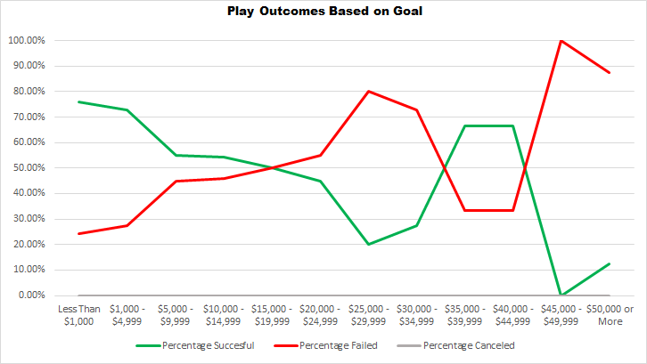

# **[Kickstarter Challenge](/Kickstarter_Challenge/)**

---

## ***Overview of Project***
- Analyize data of over four thousand Kickstarter projects from 2009 to 2017.

### Purpose
- The point of this challenge was to put my prior practice with Excel to the test by organizing a large dataset. I already used the same Kickstarter data to learn the basic and intermediate features of Excel, but this project challenged me to apply what I learned to a more in-depth analysis. Using formulas, charts, pivot tables, and pivot charts, I was able to filter an abundance of different campaigns into condensed and organized data.

## ***Analysis and Challenges***
- Using the Kickstarter dataset already provided analyze theater and play campaign outcomes based on when they launched and their target funding goal. 

### Analysis of Outcomes Based on Launch Date
- Using a pivot chart, we can see right away that the month when you launch your campaign matters a lot more than expected. With May being both the most popular and successful month to launch a theater-themed Kickstarter, we can conclude that you should start fundraising your project then. But, the same chart can be used to come to a second conclusion- when not to launch your campaign. At a glance, you might think that October would be the worst month to do so, but if you look closer, December has about the same amount of successful and failed outcomes, making it the worst month to launch your campaign.

### Analysis of Outcomes Based on Goals
- Looking at the outcomes of different plays by their funding goal gives some interesting results. You would expect to find that the more ambitious their goal was, the less likely it was to end up being successful. While that trend is seen throughout most of the graph, there is a spot between $35,000 and $45,000 that shows the opposite. Though, it should be noted that the portion of the chart accounts for less than one percent of the total amount of plays depicted.

### Challenges and Difficulties Encountered
- All of the challenges I faced collecting and putting together this data were minor, but it should be noted that they made this project a little tricker. The =COUNTIFS function used for the play outcomes based on the goals chart was clunky, and I ended up having to manually type functions out for most of the columns. Another difficulty I experienced was getting markdown to display how I wanted it to, especially for the images provided in the analysis.

## ***Results***
- **What are two conclusions you can draw about the Outcomes based on Launch Date?**  
*The best time to launch your Kickstarter is May, and the worst time to launch is December based on the data.*

- **What can you conclude about the Outcomes based on Goals?**  
*Generally speaking the higher your fundraising goal, the less likely you are to succeed in reaching that goal.*

- **What are some limitations of this dataset?**  
*The most obvious limitation of the dataset is not having any control statistics. It is nice to have more specific data, like results just on theater and plays, but it feels useless to not have any data to compare those categories to. Another limitation is how vague the charts can be without looking at the spreadsheet itself.*

- **What are some other possible tables and/or graphs that we could create?**  
*The first graphs I would add would be the same graphs, but not filtered by category. We could also add to the existing graphs by showing additional statistics when they might help explain the data more.*
